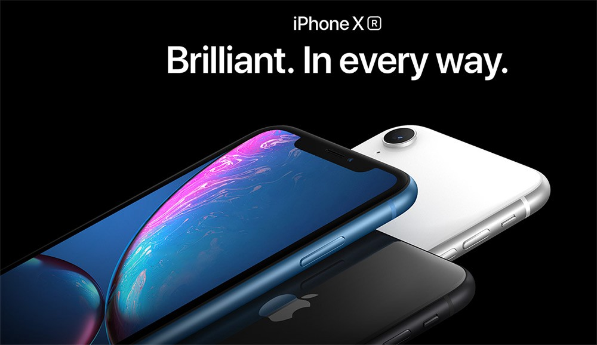

<!DOCTYPE html>
<html>
<head>
    <title>APPLE</title>
    
</head>
<body>
   
      
     
    

        <a class="active" href="https://www.apple.com/in/store">store</a>
        <a href="https://www.apple.com/in/mac/">MAC</a>
        <a href="https://www.apple.com/in/ipad/">ipad</a>
        <a href="https://www.apple.com/in/watch/">watch</a>
        <a href="https://www.apple.com/in/iphone/">iphone</a>
        <a href="https://www.apple.com/in/airpods/">airpods</a>
        <a href="https://www.apple.com/in/tv-home/">tv&home</a>
        <a href="https://www.apple.com/in/services/">onlyonapple</a>
        <a href="https://www.apple.com/in/shop/accessories/all">accessories</a>
        <a href="https://support.apple.com/en-in">support</a>
    

     
     

    
Get No Cost EMI for 3, 6 or 12 months with qualifying Credit Cards from most leading banks.

    
    

    
    
View recent apple events

    
 <a href="https://www.apple.com/in/ipad-air/">Learn more</a>  <a href="https://www.apple.com/in/shop/buy-mac/mac-studio-display">Order now</a> 

    
 <a href="https://www.apple.com/in/apple-watch-series-7/">Learn more</a> <a href="https://www.apple.com/in/shop/buy-watch/apple-watch">Buy</a>

    
 Largest Display
      The new Retina display on Apple Watch Series 7 has  nearly 20% more screen area than Series 6. Improved Durability
      Most crack-resistant front crystal. Dust resistant And swimproof. Health and Wellness
      The most advanced Apple Watch health and  wellness features yet, including the Blood Oxygen app and sensor.  footnote
  
    
    
    </body>
</html>
